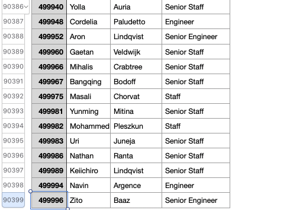
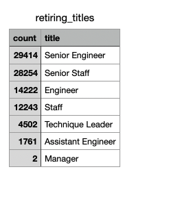
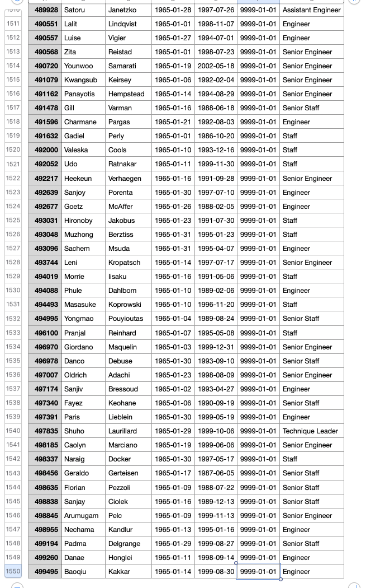

# Pewlett_Hackard_Analysis
## Overview
This analysis used PostgreSQL to create, filter employees database to determine the number of retiring employees per title, and identify employees who are eligible to participate in a mentorship program. Then,write a report that summarizes the analysis and helps prepare Bobby’s manager for the “silver tsunami” as many current employees reach retirement age.
## Results
- 90398 unique positions would be open.

- The folowing titles would be open at Pewlett Hackard. 
- 29414 Senior managers, 28254 Senior staff, 14222 Engineers, 12243 Staff, 4502 Technique Leaders 1761 Assistant Engineers and 2 managers will be retiring

- 1549 employees are eligible for retirement mentorship program 

